# Práctica 6.2 - Despliegue de una aplicación PHP con Nginx y MySQL usando Docker y Docker-Compose

## Introducción

El objetivo de esta práctica es aprender a desplegar una app PHP con Nginx y MySQL mediante Docker.

Primero nos conectamos con ssh

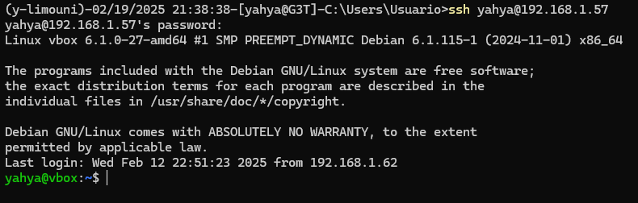

## Estructura de directorios

Realizamos la estructura de directorios siguiente:

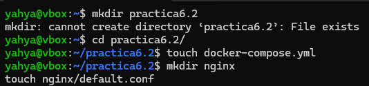

## Crear un contenedor Nginx

Editamos el archivo `docker-compose.yml` con el siguiente contenido

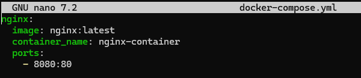

Y iniciamos el contenedor Nginx 

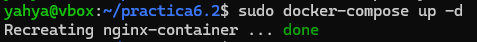

Comprobamos que ha ido bien 

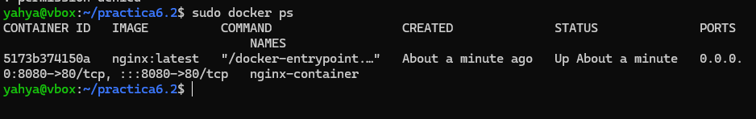

El archivo que se ha creado será el encargado de descargarse la última versión de la imagen de Nginx, crear un contenedor con ella y mapear el puerto 80 del contenedor al puerto 8080 del host.

Si accedemos a la dirección `http://192.168.1.57:8080` deberá aparecer la siguiente pantalla:

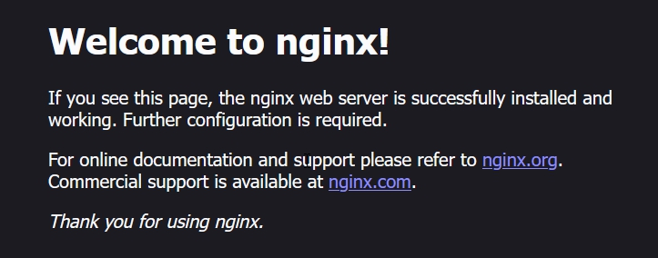

## Crear un contenedor PHP
Creamos el archivo index.php dentro de ./www/htmlq con el siguiente contenido

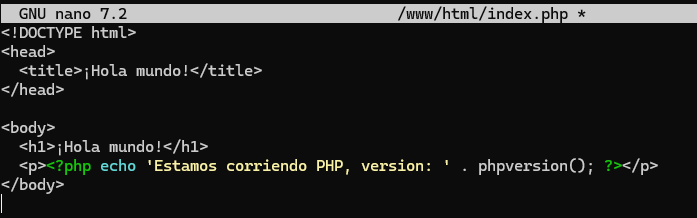

Y creamos el archivo de config deafult.conf en `./ngnix`:

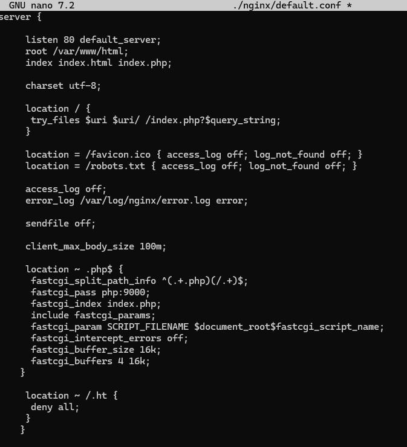

Y se modificará el archivo Dockerfile dentro del directorio nginx con el siguiente contenido:

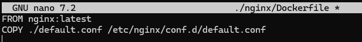

Y depues modificamos el archivo docker-compose.yml 

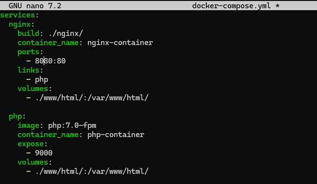

Con el fichero docker-compose.yml modificado, se creará un contenedor PHP en el puerto 9000 y enlazado con el contenedor Nginx.

Ahora levntaremos los contenedores y comprobaremos que funcionan correctamente.

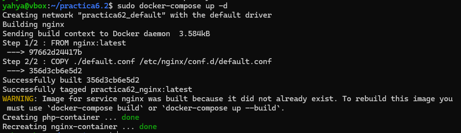

## Crear un contendor para Datos

Se deberá crear un contenedor para almacenar los datos. Para ello, se deberá modificar el archivo `docker-compose.yml` con el siguiente contenido:

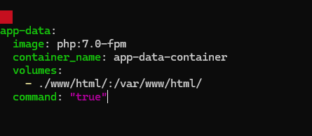

comprobamos que ha ido bien

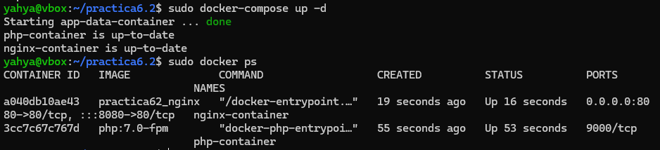

## Crear un contendor MySQL

Se deberá crear un contenedor MySQL y hacerlo funcionar para que permita alojar la base de datos de la aplicación PHP.

Para ello, se deberá modificar el archivo Dockerfile del directorio php con el siguiente contenido:

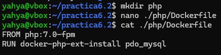

Se deberá modificar el archivo docker-compose.yml con el siguiente contenido:

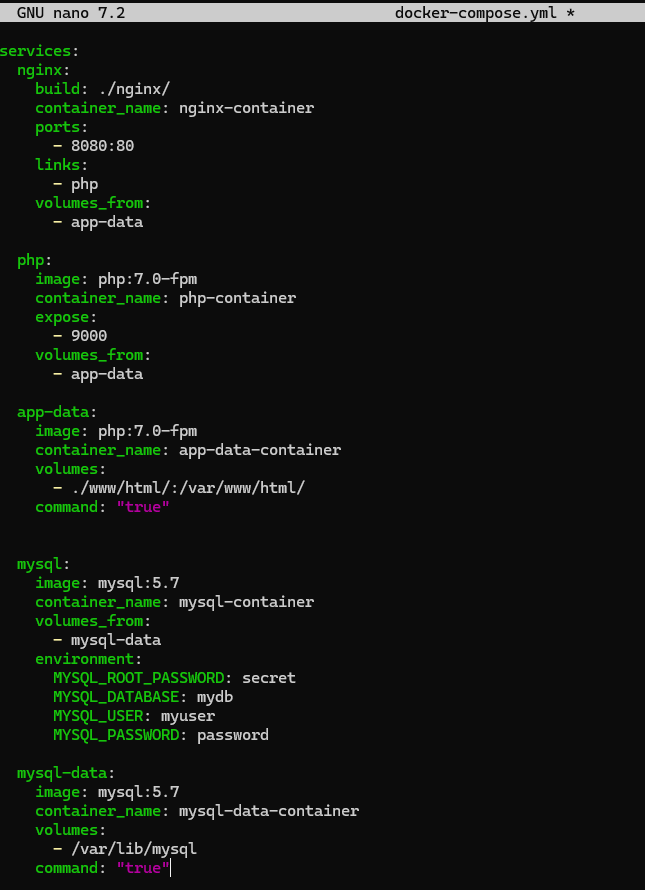

Se deberá modificar el archivo index.php con el siguiente contenido:

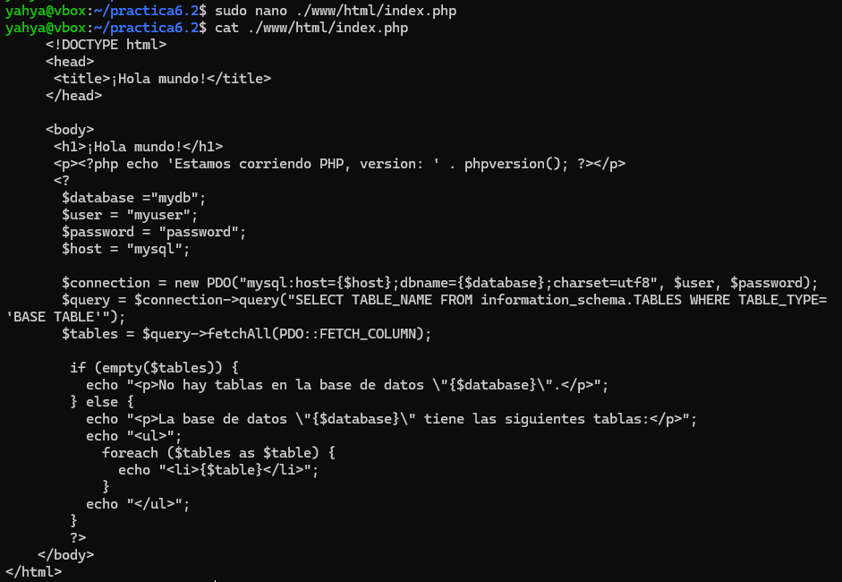

Se comprueba que el contenedor MySQL funciona correctamente.

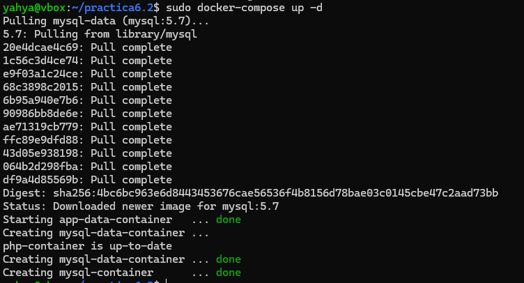

Al verificar la conexion a la base de datos, me ha salido ese error del PDO aunque he instalado mysqlpdo y pdo

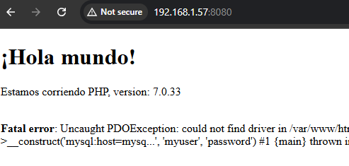
